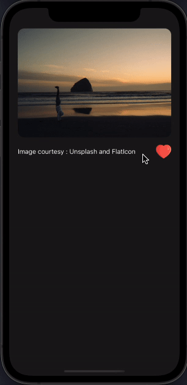

# react-native-animated-button

A simple and customizable React Native animated button component. 



## Installation
  ```
  npm install --save @nithinpp69/react-native-animated-button
  ```
## Example
```
import AnimatedButton from '@nithinpp69/react-native-animated-button';

....

<Text>Without Custom popup</Text>
<AnimatedButton
  direction="up"
>
  <Ionicons name='ios-heart' color='red' size=30>
</AnimatedButton>


<Text>With Custom popup</Text>
<AnimatedButton
  direction="up"
  infoContainer={
    <Text style={{color: 'white', fontSize: 14}}> +1 </Text>
  }
>
  <Ionicons name='ios-heart' color='red' size=30>
</AnimatedButton>


```
## Props
| Prop          | Description   | Type   | Values | Default | Required |
| :-----------: |:-------------:| :-----:| :-----: | :-----: | :-----: |
| containerStyle     | Button container style  | Object | | {{}} | False |
|   onPress   | Button onPress callback.|   Function | | {()=>{ }}| False |
|   infoContainer   | Flying container.| Element | <> | | False |
|   direction   | Flying direction.|   String |  top |up/down | False |


