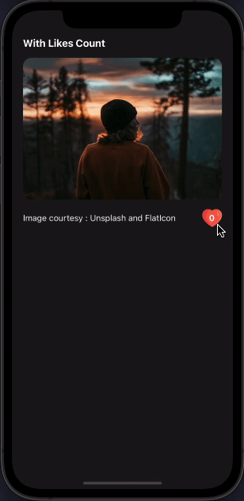

# React Native Animated Button 🔥

[]()

[](https://www.npmjs.com/package/@nithinpp69/react-native-animated-button)
[](https://www.npmjs.com/package/@nithinpp69/react-native-animated-button)

A simple and customizable React Native animated button component. 
## Demo

## ❤️ [Try on Expo Snack](https://snack.expo.dev/@nithinpp69/react-native-animated-button)



## Prerequisites

 ⚠️ Peer Dependencies

 * [react-native-reanimated-v2](https://docs.swmansion.com/react-native-reanimated/docs/fundamentals/installation/)

This component has a peer dependency on react-native-reanimated-v2. react-native-reanimated-v2 has to be installed and linked into your project.
Follow [react-native-reanimated-v2](https://docs.swmansion.com/react-native-reanimated/docs/fundamentals/installation/) to install the dependency.

## Installation

Supported version: react-native >= 0.59.0

  ```
  npm install @nithinpp69/react-native-animated-button
  ```
  
  or
  
  ```
  yarn add @nithinpp69/react-native-animated-button
  ```
## Example

#### without custom popup

```
import AnimatedButton from '@nithinpp69/react-native-animated-button';

....

<Text style={{ color: 'white', fontWeight: 'bold', fontSize: 18, marginBottom: 15, textAlign: 'left', width: '90%' }}>Without Custom Popup</Text>
<Image
  source={{ 
    uri: 'https://images.unsplash.com/photo-1634937883785-da730ecf792a?ixid=MnwxMjA3fDB8MHxwaG90by1wYWdlfHx8fGVufDB8fHx8&ixlib=rb-1.2.1&auto=format&fit=crop&w=1170&q=80' 
  }}
  style={{ width: '90%', height: 250, borderRadius: 15 }}
/>
<View style={{ width: '90%', flexDirection: 'row', alignItems: 'center', justifyContent: 'space-between', paddingTop: 15 }}>
  <Text style={{ color: 'white', fontSize: 15 }}>Image courtesy : Unsplash and FlatIcon</Text>
  <AnimatedButton>
    <Image
      source={{ uri: 'https://cdn-icons.flaticon.com/png/512/210/premium/210545.png?token=exp=1634987603~hmac=8001e17087323c73af4e1f1c9d461f53' }}
      style={{ width: 35, height: 35 }}
    />
  </AnimatedButton>
</View>

```


#### with custom popup

```
import AnimatedButton from '@nithinpp69/react-native-animated-button';

....

<Text style={{ color: 'white', fontWeight: 'bold', fontSize: 18, marginBottom: 15, textAlign: 'left', width: '90%' }}>With Custom Popup</Text>
<Image
  source={{ 
    uri: 'https://images.unsplash.com/photo-1634938971687-1082b4cb018c?ixid=MnwxMjA3fDB8MHxwaG90by1wYWdlfHx8fGVufDB8fHx8&ixlib=rb-1.2.1&auto=format&fit=crop&w=1170&q=80' 
  }}
  style={{ width: '90%', height: 250, borderRadius: 15 }}
/>
<View style={{ width: '90%', flexDirection: 'row', alignItems: 'center', justifyContent: 'space-between', paddingTop: 15 }}>
  <Text style={{ color: 'white', fontSize: 15 }}>Image courtesy : Unsplash and FlatIcon</Text>
  <AnimatedButton
    renderFlyingContainer={()=> (
      <Text style={{color: 'white', fontSize: 18, fontWeight: 'bold'}}>+1</Text>
    )}
  >
    <Image
      source={{ uri: 'https://cdn-icons.flaticon.com/png/512/210/premium/210545.png?token=exp=1634987603~hmac=8001e17087323c73af4e1f1c9d461f53' }}
      style={{ width: 35, height: 35 }}
    />
  </AnimatedButton>
</View>

```


#### with likes count

```
import AnimatedButton from '@nithinpp69/react-native-animated-button';

....

const [likeCount, setLikeCount]  = useState(0);

....

<Text style={{ color: 'white', fontWeight: 'bold', fontSize: 18, marginBottom: 15, textAlign: 'left', width: '90%' }}>With Likes Count</Text>
<Image
  source={{ 
    uri: 'https://images.unsplash.com/photo-1634938971687-1082b4cb018c?ixid=MnwxMjA3fDB8MHxwaG90by1wYWdlfHx8fGVufDB8fHx8&ixlib=rb-1.2.1&auto=format&fit=crop&w=1170&q=80' 
  }}
  style={{ width: '90%', height: 250, borderRadius: 15 }}
/>
<View style={{ width: '90%', flexDirection: 'row', alignItems: 'center', justifyContent: 'space-between', paddingTop: 15 }}>
  <Text style={{ color: 'white', fontSize: 15 }}>Image courtesy : Unsplash and FlatIcon</Text>
  <AnimatedButton
    renderFlyingContainer={() => (
      <Text style={{ color: 'white', fontSize: 18, fontWeight: 'bold' }}>+1</Text>
    )}
    onPress={() => {
      setLikeCount(count => count + 1);
    }}
  >
    <ImageBackground
      source={{ uri: 'https://cdn-icons.flaticon.com/png/512/210/premium/210545.png?token=exp=1634987603~hmac=8001e17087323c73af4e1f1c9d461f53' }}
      style={{ width: 35, height: 35, alignItems: 'center', justifyContent: 'center' }}
    >
      <Text style={{ color: 'white', fontSize: 15, fontWeight: 'bold' }}>{likeCount}</Text>
    </ImageBackground>
  </AnimatedButton>
</View>

```


## Props

| Prop | Description | Type | Default Value | Required |
| :---:|:-----------:|:----:|:-------------:|:--------:|
| onPress | button onPress callback | Function | () => {} | false |
| duration | animation duration | Number | 500 | false |
| style | button container style | Object | {} | false |
| direction | flying direction | 'up' or 'down' | 'up' | false |
| children | children component | React.ReactNode | null | false |
| renderFlyingContainer | function to render the flying container. If not given, will be replaced by children element | Function | () => null | false |
| enableScaleAnimation | enable or disable button scale animation | Boolean | true | false |
| position | flying container position based on the button element | 'left' or 'center' or 'right' | 'center' | false |
| animationEnabled | enable or disable button animation | Boolean | true | false |


